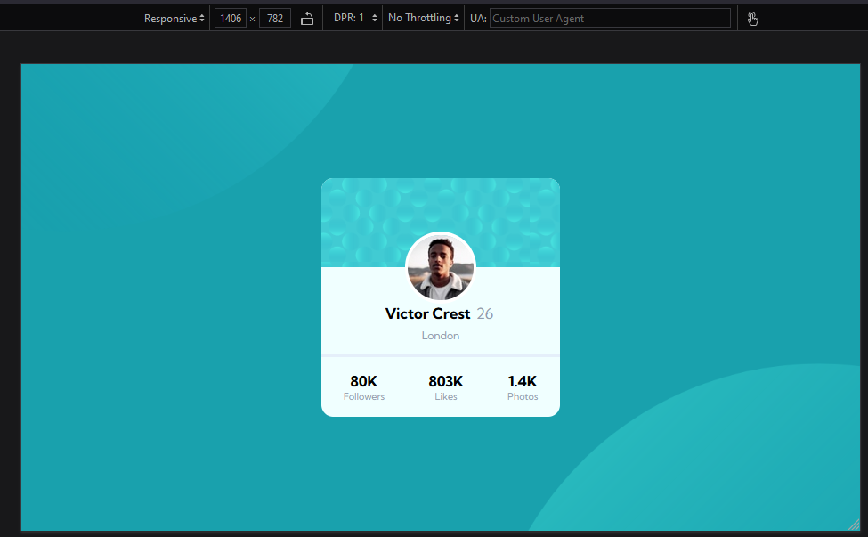
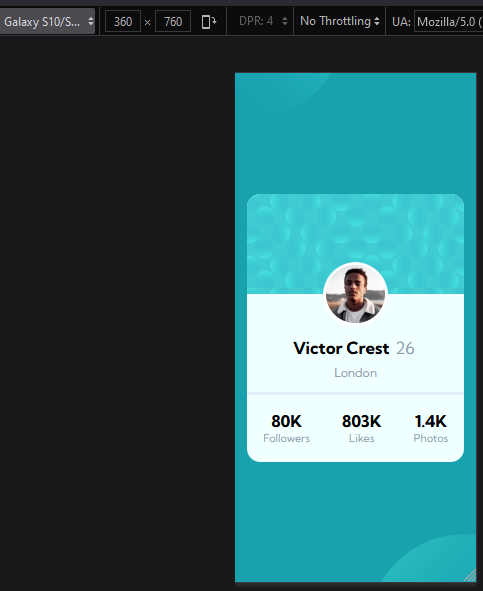

# Make It Real - Profile Card Component

This is a solution to the third project of the Make It Real course.

## Table of contents

- [Make It Real - Profile Card Component](#make-it-real---profile-card-component)
  - [Table of contents](#table-of-contents)
  - [Overview](#overview)
    - [The challenge](#the-challenge)
    - [Solution Screenshot](#solution-screenshot)
  - [My process](#my-process)
    - [Built with](#built-with)
    - [What I learned](#what-i-learned)
    - [Continued development](#continued-development)
    - [Useful resources](#useful-resources)
  - [Author](#author)
  - [Acknowledgments](#acknowledgments)

## Overview

### The challenge

Users should be able to:

- Design a user profile card as close as the screenshot picture of the project.

### Solution Screenshot




## My process

### Built with

- CSS custom properties
- Grid
- Flexbox
- Position property for layout overlaping

### What I learned

We learned how to use properties such Grid for overlaping layouts and images.

```css
.top-grid {
  display: grid;
  grid-template-columns: 1fr;
  grid-template-rows: repeat(2, 1fr);
  justify-items: center;
  align-items: center;
}

#blue-background {
  grid-row-start: 1;
  grid-row-end: 2;
  grid-column-start: 1;
  grid-column-end: -1;
  z-index: 1;
}
```

We learned also that clamp() functions is usefull for setting limits to components size (widths and heghts).

```css
#profile-card {
  height: 400px;
  width: clamp(320px, 90vw, 400px);
}
```

We learned how to import google Font-families and apply those writing styles.

```css
@import url("https://fonts.googleapis.com/css?family=Kumbh Sans");
p {
  font-size: 18px;
  font-weight: 400;
  font-family: "Kumbh Sans";
}
```

We learned how to customize the webpage Fav Icon and the window title.

```html
<link
  rel="icon"
  href="./Assets/favicon-32x32.png"
  type="image/png"
  sizes="32x32"
/>
```

### Continued development

It will be nice to use SASS and Boostrap to create CSS easier.

### Useful resources

- [Flexbox tutorial](https://www.youtube.com/watch?v=tXIhdp5R7sc) - This helped me figuring out how to use Flexbox properties.
- [Grid tutorial](https://youtu.be/rg7Fvvl3taU) - This is an overview tutorial for Grid.
- [Position property](https://youtu.be/IfMYDsorYXw) - This is an amazing tutorial for position property basic concepts.

## Author

- Github - [Juan Velasco](https://github.com/juandiegovelsol)
- Github - [Ivan Cabulo](https://github.com/icabulo)

## Acknowledgments

Kudos to our friends and mentors: Sergio Jaramilo and Daniel Espitia.
